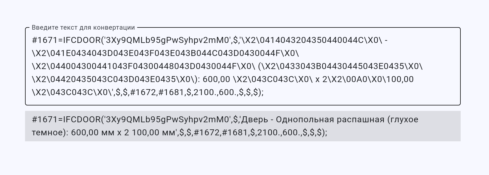

# DECODE-IFC-UNICODE

https://vdobranov.github.io/DECODE-IFC-UNICODE/

Приложение для перевода IFC-шного юникода в человекочитаемый вид.  
Просто вставить текст вида «\X2\…\X0\», получить результат:

Тут использовал интерфейсный фреймворк flet, который Python-оболочка над Flutter…, короче, долгая история. Поэтому грузиться может чуть дольше, чем ожидаешь от простой странички. Когда-нибудь перепишу на обычный HTML+CSS.