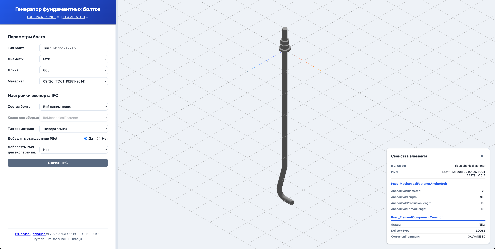

# ANCHOR-BOLT-GENERATOR

#### https://vdobranov.github.io/ANCHOR-BOLT-GENERATOR/

Генератор фундаментных болтов по ГОСТ 24379.1-2012.

Всё довольно просто — выбираешь тип болта, его диаметр и длину, потом то, какой хочешь видеть геометрию в IFC, если нужно, какие PropertySet подключать, в просмотрщике видишь свой болт и его свойства. Скачиваешь готовую IFC со своим болтом.

Просмотрщик мне стоил многих нервов. Всё таки, сложно ИИ объяснять концепции 3-хмерного мира.