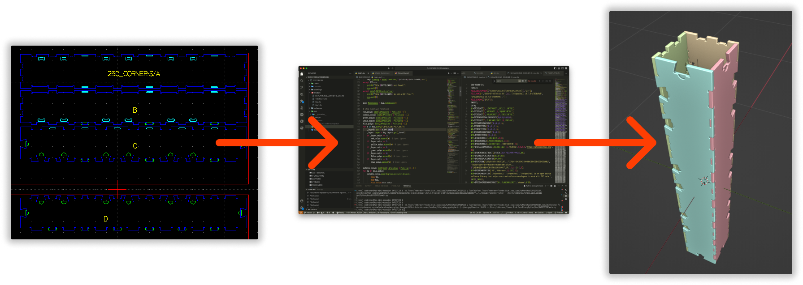

# DXF2IFC2D

#### https://github.com/VDobranov/DXF2IFC2D

Python-скрипт для преобразования DXF-раскроев Wikihouse Skylark-250 в корректные IFC-модели.

DXF-шаблоны, предназначенные для CNC-оборудования, не содержат информационной структуры, необходимой для BIM. Скрипт выполняет трёхэтапное преобразование геометрии и формирует IFC-файл с полноценной иерархией элементов. Разработан применительно к блоку CORNER-S конструктора Wikihouse Skylark.
