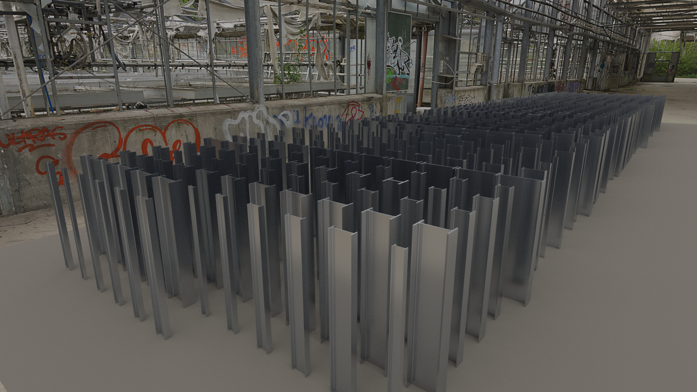

# RU_IFC_Libraries

#### https://github.com/VDobranov/RU_IFC_Libraries

IFC-библиотеки российских профилей, материалов и строительных изделий по отечественным стандартам.

Раздел **PROFILES** содержит сечения для марок КМ: двутавры, швеллеры, уголки, трубы круглые и профильные, гнутые профили, профлисты — в виде подклассов IfcProfileDef. Раздел **PRODUCTS** включает полную номенклатуру анкерных болтов исполнения 1.1 по ГОСТ 24379.1-2012. Раздел **MATERIALS** — материалы для марок КМ и КЖ в формате IfcMaterial.

Библиотеки предназначены для подключения как IfcProjectLibrary — в частности, в BonsaiBIM.

