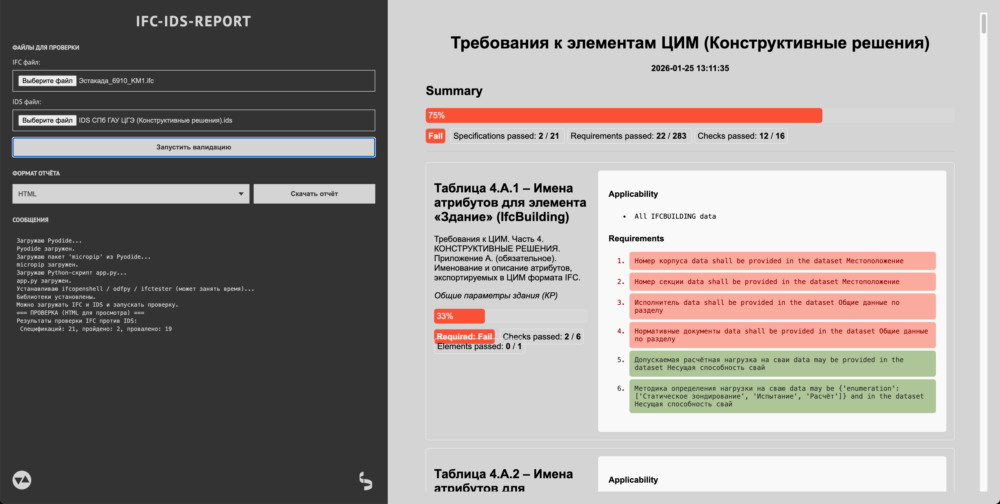
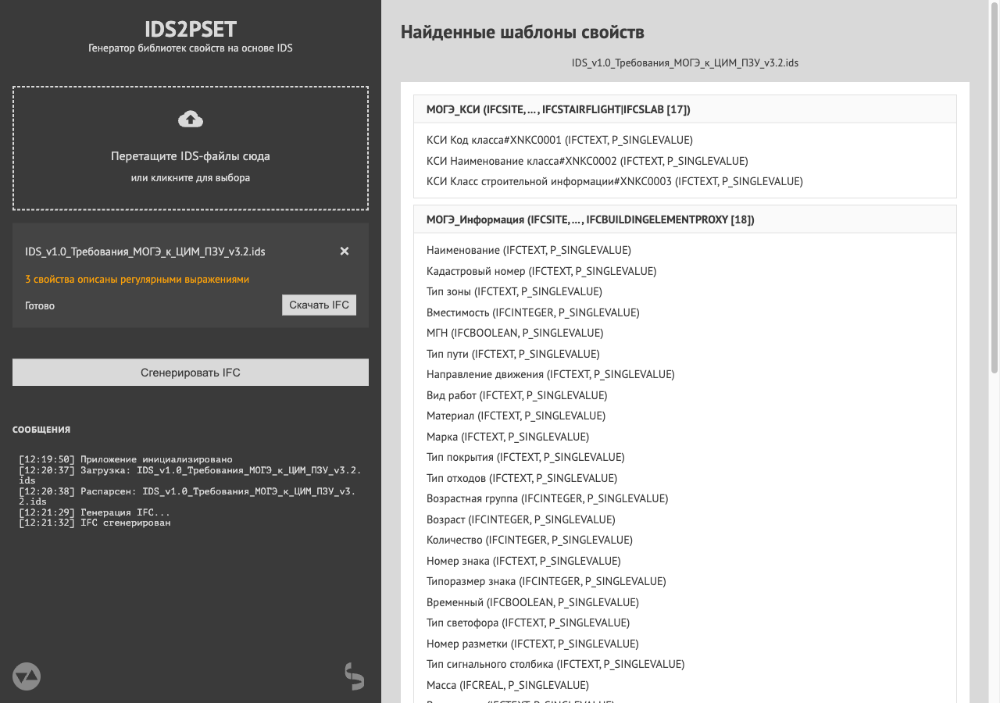

# Инструменты

В последний год плотно увлёкся разработкой всякого инструментария для/вокруг IFC, от совсем мелкого, вроде перевода закодированной кириллицы в нормальный вид, до полноценного генератора фундаментных болтов.

Масло в огонь подливают, естественно, доступные (пока?) большие языковые модели, которые демократизировали разработку до невиданных ранее масштабов. Теперь любой с минимальными навыками программирования может за выходные наклепать давно вожделенное приложение.

Так и я, последнее время практически не касаюсь кода, а только подробно описываю/ставлю задачу Qwen, массажирую его в нужные направления, ругаю трёхэтажным и скармливаю логи с ошибками. Вайбкожу.

Для инфо: всё, что описываю тут, — это одностраничные веб-приложения, работающие локально из браузера и не сохраняющие никакой информации ни на каких сторонних серверах.

## DECODE-IFC-UNICODE

https://vdobranov.github.io/DECODE-IFC-UNICODE/

Выше упомянутое приложение для перевода IFC-шного юникода в человекочитаемый вид.

Просто вставить текст вида «\X2\…\X0\», получить результат:

Тут использовал интерфейсный фреймворк flet, который Python-оболочка над Flutter…, короче, долгая история. Поэтому грузиться может чуть дольше, чем ожидаешь от простой странички. Когда-нибудь перепишу на обычный HTML+CSS.

## IFC-IDS-REPORT

https://vdobranov.github.io/IFC-IDS-REPORT/

Статическое одностраничное веб-приложение для проверки файлов IFC на соответствие спецификациям IDS.

Подгружаешь свой IFC для проверки, подгружаешь IDS, в котором требования для проверки, запускаешь валидацию, смотришь отчёт справа, скачиваешь отчёт слева в любом доступном формате (HTML, JSON, BCF, ODS).

По сути, приложение — оболочка над модулем IfcTester в библиотеке ifcopenshell. Альтернативно тем же функционалом можно воспользоваться и через командную строку, и в BonsaiBIM, и в ifctester.org.

## ANCHOR-BOLT-GENERATOR

https://vdobranov.github.io/ANCHOR-BOLT-GENERATOR/

Генератор фундаментных болтов по ГОСТ 24379.1-2012.

Всё довольно просто — выбираешь тип болта, его диаметр и длину, потом то, какой хочешь видеть геометрию в IFC, если нужно, какие PropertySet подключать, в просмотрщике видишь свой болт и его свойства. Скачиваешь готовую IFC со своим болтом.

Просмотрщик мне стоил многих нервов. Всё таки, сложно ИИ объяснять концепции 3-хмерного мира.

## IDS2PSET

https://vdobranov.github.io/IDS2PSET/

Приложение для формирования на основе требований IDS наборов свойств IfcPropertySetTemplate, которые потом можно скопировать в BonsaiBIM и подключать свойства к элементам модели. Чтобы руками не создавать все наборы, которые просит та или иная экспертиза.

В левой части подгружаешь свои IDS-требования, в правой части видишь собранные с них наборы свойств, жмёшь сгенерировать IFC, скачиваешь готовую IFC со всеми IfcPropertySetTemplate и IfcPropertyTemplate для каждой IDS.

Функционал нужно тестировать на реальных проектах, а для этого нужна огласка. Но BonsaiBIM пользуются не очень многие, поэтому есть идея, помимо шаблонных наборов свойств с IFC, формировать файл мэппинга для Revit, Tekla и проч. В первую очередь, конечно, Revit.

#IFC #IDS