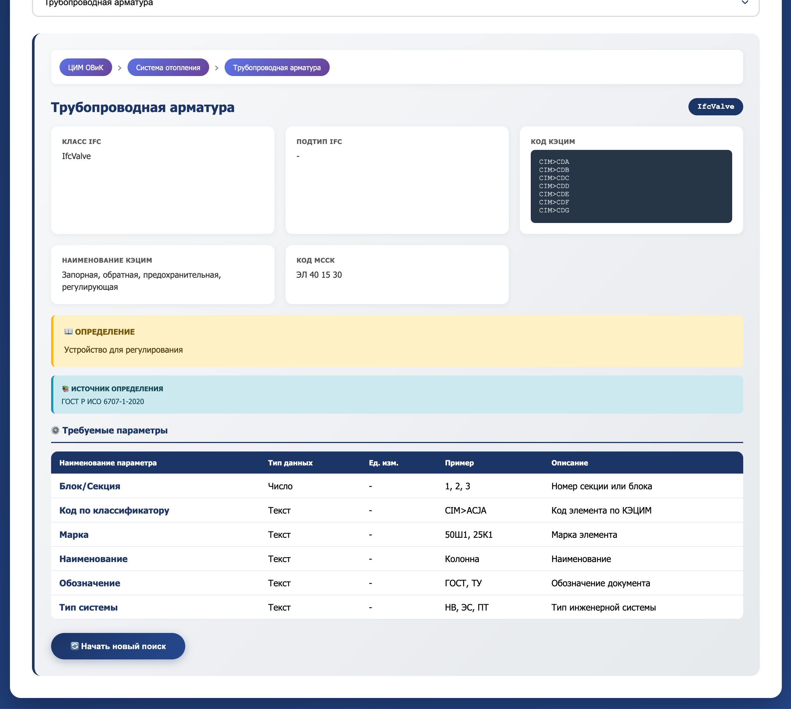
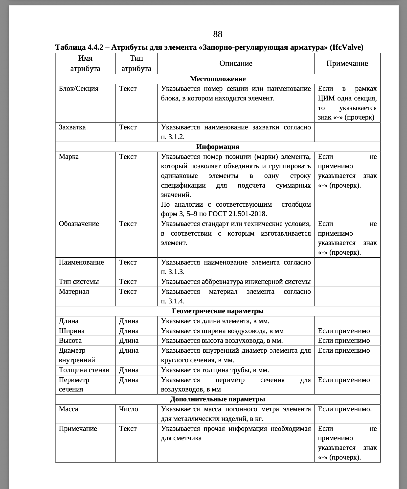
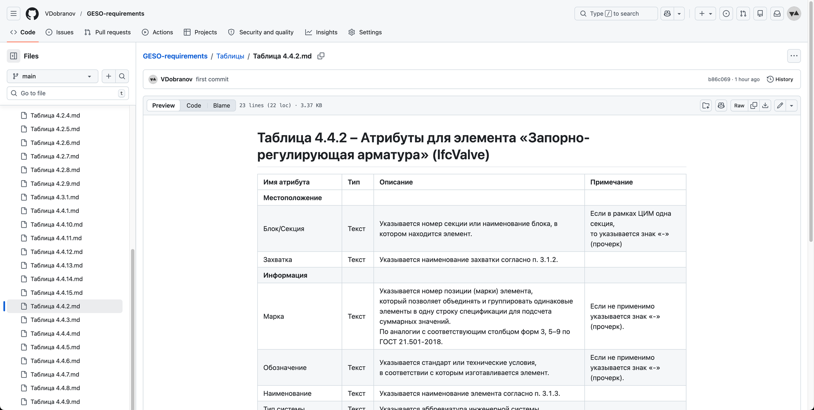
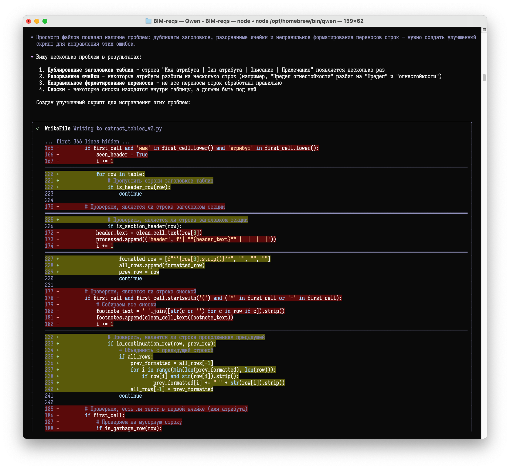

# Требования экспертизы → PSet

#### 2026-04-11

> Кратко: требования к атрибутам из ТИМ-стандарта Свердловской области теперь есть в Markdown: https://github.com/VDobranov/GESO-requirements

Затеял новый эксперимент: на входе взять табличные требования от какой-нибудь из экспертиз, а на выходе получить готовые шаблоны PSet.

Про получение шаблонов PSet из IDS уже упоминал ранее, т.е. какой-никакой инструмент для последнего шага уже есть.

Осталось придумать, как из таблицы в PDF получить IDS.

Экспертиз много, ТИМ-продвинутых тоже хватает (но, к личному сожалению, среди них нет родной Тюменской области), выбор жертвы пал на требования от Государственной экспертизы Свердловской области. С одной стороны, территориально близки, с другой, достаточно проработанные и «чистые» требования, с третьей, — коллеги активны в ТГ, я за ними послеживаю, всякие интересные штуки рассказывают и показывают.

Например, ТИМ-стандарт в формате HTML, такого я ещё ни у кого не видел. Круто и  наглядно. Единственное, смущает, что официальный их ТИМ-стандарт никак не бьётся с тем, что есть в HTML, возможно, просто ещё не доступна его новая версия. Но для нужд эксперимента хватит и предыдущей версии.
 

 

И первый шаг — взять все таблицы из PDF и перевести их в формат Markdown, чтобы ллмке (любой) проще было с ними работать.

Собственно, этот шаг сделан, результаты общедоступны: https://github.com/VDobranov/GESO-requirements
 

В репозитории есть файл extraction_prompt.md, где я писал тот промпт, с помощью которого Qwen мне и создавала весь список .md-файлов. В процессе возникла куча проблем (это же ИИ), по их решениям промпт пополнялся, корректировался и в результате перестал быть универсальным и стал очень заточенным под конкретную PDF. Но, думаю, рихтование промпта под другие требования и другие PDF всё равно будет быстрее, чем переносить эти таблицы вручную.
 

Дальше самое сложное — «скормить» нейронке эти таблицы и требования к IDS, и научить её переводить одно в другое.

Смотрю в сторону написания навыков для ИИ. Удачи мне.

#IFC #IDS #BIM
