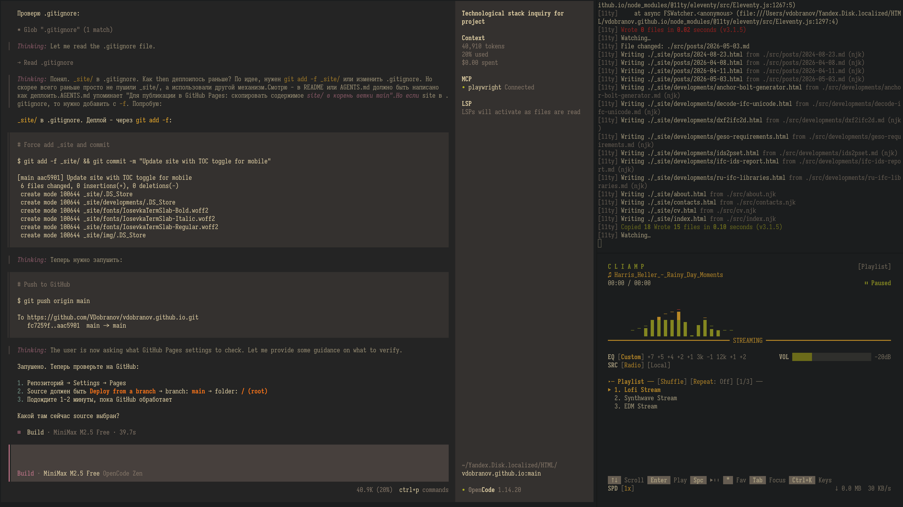
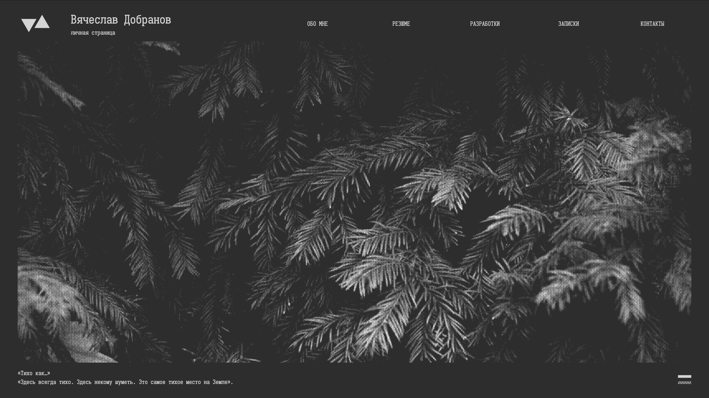

# Личная страница

#### 2026-05-03

Наконец-то осуществил давно задуманное — разработал свою личную страницу:

https://vdobranov.github.io/

На ней собрал всё, что связано с моей профессиональной деятельностью: IFC, BIM, Tekla, Python, разработки и т.п. И планирую продолжать пополнять дальше.

Началось всё как водится с мокапов в [Figma](https://www.figma.com/design/mPmMyTaiAVk16xpmxMLVjX/personal.site--Copy-?node-id=0-1&t=VrFtFmX9Mhima9sF-1) с заранее продуманными ограничениями:

- Монохромная платира;
- Моноширинный шрифт (в данном случае, конечно же Iosevka), который становится модулем для вообще всех размеров на странице;
- Соотношение элементов по золотому сечению.

Для разработки тоже пришлось продумать ограничения:

- Минимальное использование JavaScript;
- Сборка уже готовых HTML через [11ty](https://www.11ty.dev/);
- Хостинг на GithubPages (конечно же);
- Разный интерфейс для больших и маленьких экранов;
- Страницы разработок и постов — простые Markdown-файлы, которые конвертируются в HTML в момент компиляции всего остального.

В процессе как раз отключили free tier у Qwen, поэтому пришлось срочно упражняться с [opencode](https://opencode.ai/). Весьма юзабельно:

И результат пока нравится:

